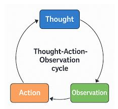
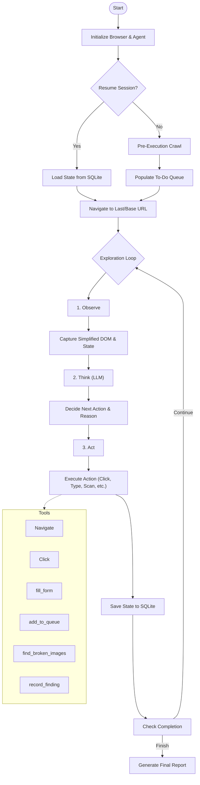

# Exploratory Testing Agent

A fully autonomous AI agent designed to explore web applications, discover bugs, and report findings using an LLM-driven "Observe-Think-Act" loop. Built with **TypeScript**, **Playwright**, and **LangChain**.

## 🚀 Overview

This agent autonomously navigates a target web application (specifically [Practice Software Testing](https://with-bugs.practicesoftwaretesting.com)), interacts with elements, and identifies bugs through multiple detection mechanisms:

- **Broken Images**: Detects 404s, missing src attributes, and zero-dimension images
- **Console Errors**: Monitors browser console for JavaScript errors and warnings
- **Network Failures**: Tracks failed HTTP requests (4xx, 5xx errors)
- **Validation Errors**: Finds visible error messages and form validation issues
- **Functional Bugs**: LLM-driven detection of broken functionality and UX issues

The agent uses an LLM to make intelligent decisions about where to go and what to test next based on the current page state.

## 🛠️ Stack

- **Language:** TypeScript
- **Browser Automation:** Playwright
- **LLM Orchestration:** LangChain
- **Persistence:** SQLite (via `bun:sqlite`)
- **CLI/UX:** @clack/prompts (Enhanced with "Agent Progress" Dashboard & Verbose Mode)
- **Runtime:** Bun

## 🏗️ Architecture

The agent follows a cyclical **Observe-Think-Act** architecture with state persistence:





### Components

1.  **Core Agent (`src/agents/exploratory.ts`)**: Manages the browser instance, state (visited URLs, findings), and the main exploration loop.
2.  **Persistence Layer (`src/repositories/session.repository.ts`)**: Handles saving and loading agent state using SQLite.
3.  **CLI (`src/index.ts`)**: Provides the user interface, session management, and status display.
4.  **Detection Tools (`src/tools/`)**:
    - `broken-images.ts`: Scans for 404s, missing src, and zero-dimension images
    - `console-errors.ts`: Monitors browser console errors and warnings
    - `network-errors.ts`: Tracks failed HTTP requests (4xx, 5xx)
    - `validation-errors.ts`: Detects visible error messages and form validation issues
    - `crawler.ts`: Pre-execution site crawler for URL discovery

### Project Structure (2026 Agent Architecture)

```
src/
├── agents/             # Logic for specialized agent types (ExploratoryAgent)
├── repositories/       # Data persistence layer (SessionRepository)
├── tools/              # Reusable functions (Action Layer)
├── services/           # External API wrappers (LLM layer)
├── types/              # Global TypeScript interfaces
├── utils/              # Helper functions (logging, reporting)
└── index.ts            # Main entry point for Bun runtime
```

## ⚙️ Design Decisions & Trade-offs

- **Playwright**: Chosen for its reliability and robust handling of modern web apps.
- **SQLite Persistence**: Used `bun:sqlite` for a lightweight, zero-dependency persistence layer, allowing the agent to be stopped and resumed without losing progress (visited pages, findings queue).
- **Pre-Execution Crawler**: Uses a lightweight spider to pre-populate the queue, ensuring broad coverage.
- **Simplified DOM Snapshot**: Processes DOM into a lightweight JSON structure to optimize token usage.
- **Human-in-the-Loop & Autonomous Modes**: Offers both interactive and fully autonomous execution modes.
- **Automatic Bug Scanning**: Automatically scans for technical errors after every interaction.
- **Deduplication**: Logic to aggregate identical findings across multiple pages to reduce report noise.

## 📦 Setup Instructions

1.  **Install Bun** (if not already installed):

    ```bash
    curl -fsSL https://bun.sh/install | bash
    ```

2.  **Install Dependencies**:

    ```bash
    bun install
    ```

3.  **Configure Environment**:

    Copy the example environment file:

    ```bash
    cp .env.example .env
    ```

    Edit `.env` to configure your LLM provider. The agent supports **Gemini** (prioritized) and any **OpenAI-Compatible** provider (OpenAI, OpenRouter, Local, etc.).

    ```env
    # Option 1: Google Gemini (Recommended)
    GOOGLE_AI_STUDIO_API_KEY=your_gemini_key_here
    GEMINI_MODEL=gemini-2.0-flash-exp

    # Option 2: Generic OpenAI Compatible (OpenAI, OpenRouter, etc.)
    OPEN_AI_API_KEY=your_api_key
    OPEN_AI_API_URL=https://api.openai.com/v1 # or https://openrouter.ai/api/v1
    OPEN_AI_MODEL=gpt-4o # or anthropic/claude-3.5-sonnet
    ```

## 🏃‍♂️ How to Run

Start the agent CLI:

```bash
bun run cli
```

1.  **Enter Target URL**: (Defaults to challenge site).
2.  **Select Mode**: Autonomous or Human-in-the-Loop.
3.  **Session Management**:
    - **Start New Session**: Begins a fresh exploration.
    - **Resume Session**: Pick from a list of recent sessions to continue where you left off.
4.  **Watch it explore!**
5.  **Report**: generated in `reports/report-<session-id>.md`. Resuming a session updates the existing report.

## 🤖 AI Usage Documentation

This project was built with significant AI assistance, leveraging the following tools and strategies:

- **Tools Used**:

  - **claude-haiku-4.5**: Used as the "brain" for the agent itself.
  - **Coding Assistant**: Used for generating boilerplate code, refining TypeScript types, and implementing the `find_broken_images` tool logic.

- **Development Process**:

  - **Architecture Design**: AI suggested the "Observe-Think-Act" loop pattern common in autonomous agents.
  - **Tool Implementation**: The `find_broken_images` logic (checking `naturalWidth`) was refined through AI suggestions to handle edge cases like tracking pixels vs actual broken images.
  - **Prompt Engineering**: The system prompt for the agent was iteratively improved by observing the agent's failures (e.g., getting stuck in loops) and asking the AI to refine the instructions to "prioritize high-value flows".

- **Validation**:

  - Generated code was manually reviewed and tested against the target site.
  - "Hallucinated" selectors were fixed by improving the DOM snapshotting logic to include robust selectors.

- **Learnings**:
  - **Context is Key**: Providing the _right_ amount of context (simplified DOM) is more effective than raw HTML.
  - **Guidance Matters**: purely autonomous agents can get lost; adding the human-in-the-loop guidance feature significantly improved the ability to reach deep pages like checkout.

## 🧪 Running Tests

To run the unit tests (if applicable):

```bash
bun test
```
