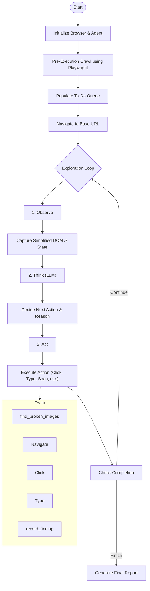

# Exploratory Testing Agent

A fully autonomous AI agent designed to explore web applications, discover bugs, and report findings using an LLM-driven "Observe-Think-Act" loop. Built with **TypeScript**, **Playwright**, and **LangChain**.

## 🚀 Overview

This agent autonomously navigates a target web application (specifically [Practice Software Testing](https://with-bugs.practicesoftwaretesting.com)), interacts with elements, detects broken images, and identifies potential bugs or UX issues. It uses an LLM to make intelligent decisions about where to go and what to test next based on the current page state.

## 🛠️ Stack

- **Language:** TypeScript
- **Browser Automation:** Playwright
- **LLM Orchestration:** LangChain
- **CLI/UX:** @clack/prompts (Enhanced with "Agent Progress" Dashboard & Verbose Mode)
- **Runtime:** Bun

## 🏗️ Architecture

The agent follows a cyclical **Observe-Think-Act** architecture:



### Components

1.  **Core Agent (`src/agent/core.ts`)**: Manages the browser instance, state (visited URLs, findings), and the main exploration loop.
2.  **CLI (`src/agent/cli.ts`)**: Provides the user interface, prompting for the target URL and displaying status.
3.  **Tools**:
    - `navigate`, `click`, `type`: Standard browser interactions.
    - `find_broken_images`: Custom tool to scan for 404s and invalid images.
    - `record_finding`: Logs discovered bugs.

## ⚙️ Design Decisions & Trade-offs

- **Playwright**: Chosen for its reliability and robust handling of modern web apps (waiting for elements, network interception) compared to Puppeteer or Selenium.
- **Pre-Execution Crawler**: Instead of starting blind, the agent uses a lightweight spider to pre-populate its queue with all discoverable links (handling SPA routes), ensuring broad coverage before visual inspection begins.
- **Simplified DOM Snapshot**: Instead of feeding the raw HTML to the LLM (which consumes too many tokens and confuses the model), we process the DOM into a simplified JSON structure of interactive elements. This strikes a balance between providing enough context and maintaining performance/cost efficiency.
- **Human-in-the-Loop & Autonomous Modes**: Added a CLI step to allow the user to guide the agent or stop exploration manually, while also offering a fully autonomous mode for unattended execution.

## 📦 Setup Instructions

1.  **Install Bun** (if not already installed):

    ```bash
    curl -fsSL https://bun.sh/install | bash
    ```

2.  **Install Dependencies**:

    ```bash
    bun install
    ```

3.  **Configure Environment**:

    Copy the example environment file:

    ```bash
    cp .env.example .env
    ```

    Edit `.env` and add your API key for **Google Gemini** or **OpenRouter**:

    ```env
    # Example for Google Gemini
    GOOGLE_AI_STUDIO_API_KEY=your_api_key_here
    GEMINI_MODEL=gemini-2.0-flash-exp

    # OR for OpenRouter
    OPEN_ROUTER_API_KEY=your_key_here
    OPEN_ROUTER_MODEL=anthropic/claude-3.5-sonnet
    ```

## 🏃‍♂️ How to Run

Start the agent CLI:

```bash
bun run cli
```

1.  Enter the target URL when prompted (defaults to the challenge site).
2.  Watch the agent explore!
3.  Provide guidance if needed, or let it run.
4.  When finished (or stopped), the agent generates a Markdown report in `reports/`.

## 🤖 AI Usage Documentation

This project was built with significant AI assistance, leveraging the following tools and strategies:

- **Tools Used**:

  - **Google Gemini 2.0 Flash**: Used as the "brain" for the agent itself.
  - **Coding Assistant**: Used for generating boilerplate code, refining TypeScript types, and implementing the `find_broken_images` tool logic.

- **Development Process**:

  - **Architecture Design**: AI suggested the "Observe-Think-Act" loop pattern common in autonomous agents.
  - **Tool Implementation**: The `find_broken_images` logic (checking `naturalWidth`) was refined through AI suggestions to handle edge cases like tracking pixels vs actual broken images.
  - **Prompt Engineering**: The system prompt for the agent was iteratively improved by observing the agent's failures (e.g., getting stuck in loops) and asking the AI to refine the instructions to "prioritize high-value flows".

- **Validation**:

  - Generated code was manually reviewed and tested against the target site.
  - "Hallucinated" selectors were fixed by improving the DOM snapshotting logic to include robust selectors.

- **Learnings**:
  - **Context is Key**: Providing the _right_ amount of context (simplified DOM) is more effective than raw HTML.
  - **Guidance Matters**: purely autonomous agents can get lost; adding the human-in-the-loop guidance feature significantly improved the ability to reach deep pages like checkout.

## 🧪 Running Tests

To run the unit tests (if applicable):

```bash
bun test
```
