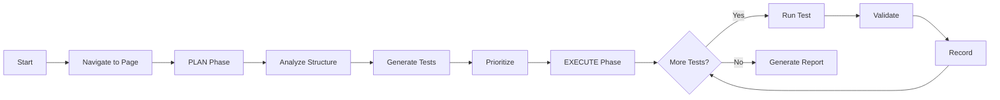

# 🎯 Feature: Implement Single-Page Testing Agent with Plan-Execute Architecture

## 📋 Summary

Implement a new **Single-Page Testing Agent** that uses a **Plan-Execute** architectural pattern to comprehensively test all features and interactions on a single web page. This agent will complement the existing exploratory agent by providing deep, systematic testing of individual pages.

## 🎯 Motivation

The current `ExploratoryAgent` excels at breadth-first exploration across multiple pages but has limitations in deep feature testing:

- ❌ Shallow testing - moves to new pages quickly without exhaustive testing
- ❌ Limited feature coverage - may miss complex interaction patterns
- ❌ No systematic planning - reactive rather than proactive
- ❌ Incomplete state coverage - doesn't explore all UI states

Many critical bugs exist in complex page interactions that require:
- ✅ Testing all form fields with various input combinations
- ✅ Exploring all button/link interactions and outcomes
- ✅ Validating all conditional UI states (modals, dropdowns, tooltips)
- ✅ Testing edge cases and boundary conditions
- ✅ Verifying multi-step workflows within a single page

## 🏗️ Proposed Solution

Create a new agent that operates in two distinct phases:

### 1️⃣ **PLAN Phase**
- Analyze page structure and extract all testable elements
- Generate comprehensive test plan using LLM
- Prioritize test cases by risk and importance
- Estimate test duration and coverage

### 2️⃣ **EXECUTE Phase**
- Systematically execute each test case
- Validate outcomes against expectations
- Record findings and screenshots
- Adapt plan based on discoveries

## 🎨 Architecture



## 📦 Implementation Tasks

### Phase 1: Core Infrastructure
- [ ] Create `SinglePageTestingAgent` class in `src/agents/single-page.ts`
- [ ] Define new TypeScript interfaces in `src/types/index.ts`:
  - `SinglePageTestConfig`
  - `TestCase`
  - `TestPlan`
  - `TestResult`
  - `SinglePageTestState`
  - `PageSnapshot`
- [ ] Implement basic plan-execute loop
- [ ] Add session persistence for test plans

### Phase 2: Planning Phase Tools
- [ ] Implement `analyzePageStructure()` in `src/tools/page-analyzer.ts`
  - Extract all interactive elements (forms, buttons, inputs, links)
  - Identify element relationships
  - Detect dynamic elements (modals, dropdowns)
  - Map page states
- [ ] Create `generateTestPlan()` in `src/tools/test-planner.ts`
  - LLM-driven test case generation
  - Form validation tests (valid/invalid/boundary)
  - Button/link interaction tests
  - Edge case tests
- [ ] Implement `prioritizeTestCases()` in `src/tools/test-planner.ts`
  - Risk-based prioritization
  - Critical path identification

### Phase 3: Execution Phase Tools
- [ ] Implement `executeTestCase()` in `src/tools/test-executor.ts`
  - Sequential step execution
  - State setup and cleanup
  - Error handling and recovery
- [ ] Create `validateTestOutcome()` in `src/tools/test-validator.ts`
  - Expected vs actual comparison
  - LLM-driven validation
  - Automatic bug detection
- [ ] Implement `resetPageState()` in `src/tools/test-executor.ts`
  - Page refresh mechanism
  - State isolation between tests

### Phase 4: Reporting & Integration
- [ ] Create test report generator in `src/utils/test-reporter.ts`
  - Detailed test results
  - Coverage metrics
  - Screenshots for failures
  - Test plan export
- [ ] Add CLI integration in `src/index.ts`
  - Single-page mode option
  - Test strategy selection
  - Session management
- [ ] Update documentation
  - README with usage examples
  - Architecture diagrams
  - API documentation

## 🔧 Technical Details

### New File Structure
```
src/
├── agents/
│   ├── exploratory.ts          # Existing
│   └── single-page.ts          # NEW
├── tools/
│   ├── page-analyzer.ts        # NEW
│   ├── test-planner.ts         # NEW
│   ├── test-executor.ts        # NEW
│   └── test-validator.ts       # NEW
├── utils/
│   └── test-reporter.ts        # NEW
└── types/
    └── index.ts                # Updated with new interfaces
```

### Key Interfaces

```typescript
export interface TestCase {
  id: string;
  name: string;
  description: string;
  priority: 'critical' | 'high' | 'medium' | 'low';
  category: 'form' | 'navigation' | 'interaction' | 'validation' | 'visual';
  steps: TestStep[];
  expectedOutcome: string;
  preconditions?: string[];
}

export interface TestPlan {
  pageUrl: string;
  pageTitle: string;
  totalTests: number;
  testCases: TestCase[];
  coverage: {
    forms: number;
    buttons: number;
    links: number;
    inputs: number;
    otherInteractive: number;
  };
  estimatedDuration: number;
}
```

## ✅ Success Criteria

- [ ] Agent can analyze any page and generate a comprehensive test plan
- [ ] Test plans include 100% coverage of interactive elements
- [ ] Agent can execute test plans systematically
- [ ] Automatic validation detects common bug types
- [ ] Test results are saved and can be re-executed
- [ ] Integration with existing CLI works seamlessly
- [ ] Documentation is complete and clear

## 📊 Metrics

- **Coverage**: % of interactive elements tested
- **Bug Detection**: Number of unique bugs found per page
- **Efficiency**: Time to complete comprehensive page test
- **Reproducibility**: Ability to re-run same test plan
- **Adaptability**: % of dynamically discovered elements tested

## 🤔 Open Questions

1. **State Management**: How to handle complex page states (e.g., logged in vs out)?
   - Proposed: Allow preconditions in test cases
2. **Test Data**: Should we generate test data or require user input?
   - Proposed: LLM generates realistic test data
3. **Parallel Execution**: Can we safely run tests in parallel?
   - Proposed: Start with sequential, add parallel later
4. **Integration**: How does this integrate with exploratory agent?
   - Proposed: Separate modes, potential hybrid later

## 📚 References

- [RFC Document](file:///home/crislerwintler/Projects/voidr-tech-challenge/docs/rfc-single-page-testing-agent.md)
- [Existing ExploratoryAgent](file:///home/crislerwintler/Projects/voidr-tech-challenge/src/agents/exploratory.ts)
- [ReAct Paper](https://arxiv.org/abs/2210.03629)
- [LangChain Plan-and-Execute](https://python.langchain.com/docs/modules/agents/agent_types/plan_and_execute)

## 🎯 Acceptance Criteria

### Must Have
- ✅ Complete plan-execute loop implementation
- ✅ Page structure analysis tool
- ✅ LLM-driven test plan generation
- ✅ Test case execution engine
- ✅ Automatic validation and bug detection
- ✅ Test report generation
- ✅ CLI integration

### Should Have
- ✅ Test plan persistence and replay
- ✅ Configurable test strategies (quick/comprehensive)
- ✅ Screenshot capture for failures
- ✅ Coverage metrics

### Nice to Have
- ⭐ Parallel test execution
- ⭐ Test data generation
- ⭐ Hybrid mode with exploratory agent
- ⭐ Test plan import/export

## 💡 Example Usage

```bash
# Start single-page testing agent
bun run cli

# Select "Single-Page Testing" mode
# Enter target URL: https://example.com/checkout
# Select strategy: comprehensive

# Agent will:
# 1. Analyze the checkout page
# 2. Generate test plan (e.g., 25 test cases)
# 3. Execute each test systematically
# 4. Generate detailed report
```

## 🚀 Timeline

- **Step 1**: Core infrastructure and types
- **Step 2**: Planning phase implementation
- **Step 3**: Execution phase implementation
- **Step 4**: Reporting and integration


## 👥 Stakeholders

- **Development Team**: Implementation
- **QA Team**: Testing and validation
- **Product Team**: Requirements and priorities

---

**Labels**: `enhancement`, `agent`, `testing`, `plan-execute`  
**Priority**: High  
**Effort**: Large  
**Type**: Feature
