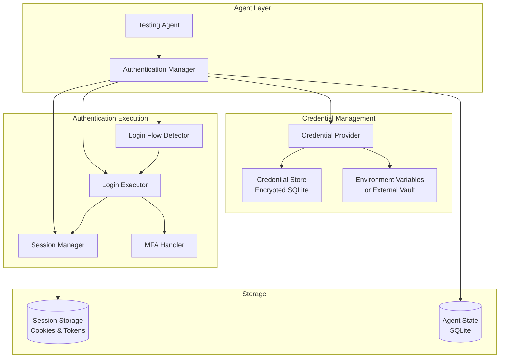

# RFC: Authentication & Credential Management for Universal Application Testing

**Status:** Draft  
**Author:** Crisler Wintler  
**Created:** 2026-01-08  
**Updated:** 2026-01-08

## Executive Summary

This RFC proposes implementing **authentication and credential management** capabilities to enable testing agents to test any web application, including those requiring login. The system will support automatic login detection, secure credential storage, and intelligent authentication flow execution, allowing agents to access protected areas of applications with existing accounts.

## Motivation

### Current State

The existing testing agents have significant limitations when testing authenticated applications:
- ❌ Cannot access pages behind login walls
- ❌ No credential management system
- ❌ Cannot test user-specific features (dashboards, profiles, settings)
- ❌ Limited to public pages only
- ❌ Cannot test role-based access control
- ❌ No support for different authentication methods

### Problem Statement

Most modern web applications require authentication to access core functionality:
- **E-commerce**: Checkout, order history, account settings
- **SaaS Applications**: Dashboards, user management, billing
- **Social Platforms**: Profiles, messaging, content creation
- **Banking/Finance**: Account details, transactions, transfers
- **Healthcare**: Patient portals, medical records

**Testing these applications requires:**
1. Secure credential storage
2. Automatic login flow detection
3. Support for multiple authentication methods
4. Session management and persistence
5. Multi-account testing (different roles/permissions)
6. Security and compliance

### Proposed Solution

Implement a comprehensive authentication system that:
1. **Detects** login pages and authentication requirements automatically
2. **Stores** credentials securely with encryption
3. **Executes** login flows intelligently using LLM guidance
4. **Manages** sessions and cookies across test runs
5. **Supports** multiple authentication methods (form-based, OAuth, SSO, MFA)
6. **Enables** multi-account testing for role-based scenarios

## Design

### Architecture Overview



### Core Components

#### 1. Authentication Manager

Central orchestrator for all authentication operations.

```typescript
// src/auth/auth-manager.ts
export class AuthenticationManager {
  private credentialProvider: CredentialProvider;
  private loginDetector: LoginFlowDetector;
  private loginExecutor: LoginExecutor;
  private sessionManager: SessionManager;
  
  constructor(config: AuthConfig) {
    this.credentialProvider = new CredentialProvider(config);
    this.loginDetector = new LoginFlowDetector();
    this.loginExecutor = new LoginExecutor(config);
    this.sessionManager = new SessionManager();
  }
  
  /**
   * Authenticate to an application
   */
  async authenticate(
    page: Page,
    appIdentifier: string
  ): Promise<AuthResult> {
    // 1. Check if already authenticated
    if (await this.isAuthenticated(page)) {
      return { success: true, method: "session-reuse" };
    }
    
    // 2. Restore session if available
    const restored = await this.sessionManager.restoreSession(
      page,
      appIdentifier
    );
    if (restored && await this.isAuthenticated(page)) {
      return { success: true, method: "session-restore" };
    }
    
    // 3. Detect login flow
    const loginFlow = await this.loginDetector.detect(page);
    if (!loginFlow) {
      throw new Error("Could not detect login flow");
    }
    
    // 4. Get credentials
    const credentials = await this.credentialProvider.getCredentials(
      appIdentifier
    );
    
    // 5. Execute login
    const result = await this.loginExecutor.execute(
      page,
      loginFlow,
      credentials
    );
    
    // 6. Save session
    if (result.success) {
      await this.sessionManager.saveSession(page, appIdentifier);
    }
    
    return result;
  }
  
  /**
   * Check if currently authenticated
   */
  async isAuthenticated(page: Page): Promise<boolean> {
    // LLM-based detection of authentication state
    // Look for: logout buttons, user menus, profile links, etc.
  }
}
```

#### 2. Credential Provider

Manages secure credential storage and retrieval.

```typescript
// src/auth/credential-provider.ts
export interface Credentials {
  username?: string;
  email?: string;
  password: string;
  totpSecret?: string; // For MFA
  additionalFields?: Record<string, string>;
}

export interface CredentialConfig {
  appIdentifier: string;
  credentials: Credentials;
  description?: string; // Optional description for documentation
}

export class CredentialProvider {
  private storage: CredentialStorage;
  
  constructor(config: AuthConfig) {
    this.storage = new CredentialStorage(config.storageType);
  }
  
  /**
   * Get credentials for an application
   */
  async getCredentials(appIdentifier: string): Promise<Credentials> {
    // Try environment variables first
    const envCreds = this.getFromEnvironment(appIdentifier);
    if (envCreds) return envCreds;
    
    // Fall back to encrypted storage
    return await this.storage.get(appIdentifier);
  }
  
  /**
   * Store credentials securely
   */
  async storeCredentials(
    appIdentifier: string,
    credentials: Credentials
  ): Promise<void> {
    await this.storage.set(appIdentifier, credentials);
  }
  
  /**
   * Get credentials from environment variables
   */
  private getFromEnvironment(appIdentifier: string): Credentials | null {
    const prefix = `AUTH_${appIdentifier.toUpperCase().replace(/[^A-Z0-9]/g, "_")}`;
    
    const username = process.env[`${prefix}_USERNAME`];
    const email = process.env[`${prefix}_EMAIL`];
    const password = process.env[`${prefix}_PASSWORD`];
    const totpSecret = process.env[`${prefix}_TOTP_SECRET`];
    
    if (!password) return null;
    
    return {
      username,
      email,
      password,
      totpSecret,
    };
  }
}
```

#### 3. Credential Storage

Encrypted storage for credentials.

```typescript
// src/auth/credential-storage.ts
import { Database } from "bun:sqlite";
import { createCipheriv, createDecipheriv, randomBytes } from "crypto";

export class CredentialStorage {
  private db: Database;
  private encryptionKey: Buffer;
  
  constructor(storageType: "sqlite" | "memory" = "sqlite") {
    this.db = new Database("credentials.sqlite");
    this.encryptionKey = this.getOrCreateEncryptionKey();
    this.initializeDatabase();
  }
  
  private initializeDatabase() {
    this.db.exec(`
      CREATE TABLE IF NOT EXISTS credentials (
        app_identifier TEXT PRIMARY KEY,
        encrypted_data TEXT NOT NULL,
        iv TEXT NOT NULL,
        metadata TEXT,
        created_at INTEGER NOT NULL,
        updated_at INTEGER NOT NULL
      )
    `);
  }
  
  private getOrCreateEncryptionKey(): Buffer {
    // Get from environment or generate
    const keyEnv = process.env.CREDENTIAL_ENCRYPTION_KEY;
    if (keyEnv) {
      return Buffer.from(keyEnv, "hex");
    }
    
    // Generate new key (should be stored securely)
    const key = randomBytes(32);
    console.warn(
      "⚠️  Generated new encryption key. Set CREDENTIAL_ENCRYPTION_KEY env var:"
    );
    console.warn(`CREDENTIAL_ENCRYPTION_KEY=${key.toString("hex")}`);
    return key;
  }
  
  async set(appIdentifier: string, credentials: Credentials): Promise<void> {
    const iv = randomBytes(16);
    const cipher = createCipheriv("aes-256-cbc", this.encryptionKey, iv);
    
    const data = JSON.stringify(credentials);
    let encrypted = cipher.update(data, "utf8", "hex");
    encrypted += cipher.final("hex");
    
    const stmt = this.db.prepare(`
      INSERT OR REPLACE INTO credentials 
      (app_identifier, encrypted_data, iv, created_at, updated_at)
      VALUES (?, ?, ?, ?, ?)
    `);
    
    const now = Date.now();
    stmt.run(appIdentifier, encrypted, iv.toString("hex"), now, now);
  }
  
  async get(appIdentifier: string): Promise<Credentials> {
    const stmt = this.db.prepare(`
      SELECT encrypted_data, iv FROM credentials 
      WHERE app_identifier = ?
    `);
    
    const row = stmt.get(appIdentifier) as any;
    if (!row) {
      throw new Error(`No credentials found for ${appIdentifier}`);
    }
    
    const iv = Buffer.from(row.iv, "hex");
    const decipher = createDecipheriv("aes-256-cbc", this.encryptionKey, iv);
    
    let decrypted = decipher.update(row.encrypted_data, "hex", "utf8");
    decrypted += decipher.final("utf8");
    
    return JSON.parse(decrypted);
  }
}
```

#### 4. Login Flow Detector

Intelligently detects login pages and authentication requirements.

```typescript
// src/auth/login-detector.ts
export interface LoginFlow {
  type: "form" | "oauth" | "sso" | "magic-link" | "unknown";
  formSelector?: string;
  usernameField?: string;
  emailField?: string;
  passwordField?: string;
  submitButton?: string;
  mfaRequired?: boolean;
  oauthProvider?: string;
  additionalSteps?: LoginStep[];
}

export interface LoginStep {
  type: "input" | "click" | "wait" | "mfa";
  selector?: string;
  value?: string;
  description: string;
}

export class LoginFlowDetector {
  /**
   * Detect login flow on current page
   */
  async detect(page: Page): Promise<LoginFlow | null> {
    // 1. Check if we're on a login page
    const isLoginPage = await this.isLoginPage(page);
    if (!isLoginPage) return null;
    
    // 2. Extract form elements
    const formElements = await page.evaluate(() => {
      const forms = document.querySelectorAll("form");
      const inputs = document.querySelectorAll(
        'input[type="text"], input[type="email"], input[type="password"]'
      );
      const buttons = document.querySelectorAll(
        'button[type="submit"], input[type="submit"]'
      );
      
      return {
        forms: Array.from(forms).map((f) => ({
          action: f.action,
          method: f.method,
          id: f.id,
          className: f.className,
        })),
        inputs: Array.from(inputs).map((i) => ({
          type: (i as HTMLInputElement).type,
          name: (i as HTMLInputElement).name,
          id: i.id,
          placeholder: (i as HTMLInputElement).placeholder,
          autocomplete: (i as HTMLInputElement).autocomplete,
        })),
        buttons: Array.from(buttons).map((b) => ({
          text: b.textContent?.trim(),
          type: (b as HTMLButtonElement).type,
          id: b.id,
        })),
      };
    });
    
    // 3. Use LLM to analyze and identify login flow
    const loginFlow = await this.analyzeWithLLM(page, formElements);
    
    return loginFlow;
  }
  
  private async isLoginPage(page: Page): Promise<boolean> {
    const url = page.url().toLowerCase();
    const title = (await page.title()).toLowerCase();
    
    // Simple heuristics
    const loginKeywords = [
      "login",
      "signin",
      "sign-in",
      "log-in",
      "authenticate",
      "auth",
    ];
    
    return (
      loginKeywords.some((kw) => url.includes(kw) || title.includes(kw))
    );
  }
  
  private async analyzeWithLLM(
    page: Page,
    formElements: any
  ): Promise<LoginFlow> {
    // Use LLM to intelligently identify login form fields
    // This handles non-standard forms, custom implementations, etc.
    // Returns structured LoginFlow object
  }
}
```

#### 5. Login Executor

Executes login flows with LLM guidance.

```typescript
// src/auth/login-executor.ts
export class LoginExecutor {
  private model: BaseChatModel;
  private mfaHandler: MFAHandler;
  
  constructor(config: AuthConfig) {
    this.model = config.model || getDefaultModel();
    this.mfaHandler = new MFAHandler();
  }
  
  async execute(
    page: Page,
    loginFlow: LoginFlow,
    credentials: Credentials
  ): Promise<AuthResult> {
    try {
      switch (loginFlow.type) {
        case "form":
          return await this.executeFormLogin(page, loginFlow, credentials);
        case "oauth":
          return await this.executeOAuthLogin(page, loginFlow, credentials);
        case "sso":
          return await this.executeSSOLogin(page, loginFlow, credentials);
        default:
          return await this.executeLLMGuidedLogin(
            page,
            loginFlow,
            credentials
          );
      }
    } catch (error: any) {
      return {
        success: false,
        method: loginFlow.type,
        error: error.message,
      };
    }
  }
  
  private async executeFormLogin(
    page: Page,
    loginFlow: LoginFlow,
    credentials: Credentials
  ): Promise<AuthResult> {
    // Fill username/email
    if (loginFlow.emailField && credentials.email) {
      await page.fill(loginFlow.emailField, credentials.email);
    } else if (loginFlow.usernameField && credentials.username) {
      await page.fill(loginFlow.usernameField, credentials.username);
    }
    
    // Fill password
    if (loginFlow.passwordField) {
      await page.fill(loginFlow.passwordField, credentials.password);
    }
    
    // Submit
    if (loginFlow.submitButton) {
      await page.click(loginFlow.submitButton);
    }
    
    // Wait for navigation or error
    await page.waitForTimeout(2000);
    
    // Handle MFA if required
    if (loginFlow.mfaRequired && credentials.totpSecret) {
      await this.mfaHandler.handleTOTP(page, credentials.totpSecret);
    }
    
    // Verify success
    const success = await this.verifyLoginSuccess(page);
    
    return {
      success,
      method: "form",
    };
  }
  
  private async executeLLMGuidedLogin(
    page: Page,
    loginFlow: LoginFlow,
    credentials: Credentials
  ): Promise<AuthResult> {
    // Use LLM to guide login process for non-standard flows
    // Similar to agent's step() method but focused on login
  }
  
  private async verifyLoginSuccess(page: Page): Promise<boolean> {
    // Check for common success indicators
    const indicators = await page.evaluate(() => {
      const hasLogout = !!document.querySelector(
        'a[href*="logout"], button:has-text("logout"), button:has-text("sign out")'
      );
      const hasUserMenu = !!document.querySelector(
        '[class*="user-menu"], [class*="profile"], [id*="user-menu"]'
      );
      const hasErrorMessage = !!document.querySelector(
        '[class*="error"], [class*="alert"], [role="alert"]'
      );
      
      return { hasLogout, hasUserMenu, hasErrorMessage };
    });
    
    return (
      (indicators.hasLogout || indicators.hasUserMenu) &&
      !indicators.hasErrorMessage
    );
  }
}
```

#### 6. Session Manager

Manages browser sessions and cookies.

```typescript
// src/auth/session-manager.ts
export class SessionManager {
  private db: Database;
  
  constructor() {
    this.db = new Database("sessions.sqlite");
    this.initializeDatabase();
  }
  
  private initializeDatabase() {
    this.db.exec(`
      CREATE TABLE IF NOT EXISTS sessions (
        app_identifier TEXT PRIMARY KEY,
        cookies TEXT NOT NULL,
        storage_state TEXT,
        expires_at INTEGER,
        created_at INTEGER NOT NULL,
        updated_at INTEGER NOT NULL
      )
    `);
  }
  
  async saveSession(page: Page, appIdentifier: string): Promise<void> {
    const context = page.context();
    const cookies = await context.cookies();
    const storageState = await context.storageState();
    
    const stmt = this.db.prepare(`
      INSERT OR REPLACE INTO sessions 
      (app_identifier, cookies, storage_state, expires_at, created_at, updated_at)
      VALUES (?, ?, ?, ?, ?, ?)
    `);
    
    const now = Date.now();
    const expiresAt = now + 24 * 60 * 60 * 1000; // 24 hours
    
    stmt.run(
      appIdentifier,
      JSON.stringify(cookies),
      JSON.stringify(storageState),
      expiresAt,
      now,
      now
    );
  }
  
  async restoreSession(page: Page, appIdentifier: string): Promise<boolean> {
    const stmt = this.db.prepare(`
      SELECT cookies, storage_state, expires_at FROM sessions 
      WHERE app_identifier = ? AND expires_at > ?
    `);
    
    const row = stmt.get(appIdentifier, Date.now()) as any;
    if (!row) return false;
    
    try {
      const context = page.context();
      const cookies = JSON.parse(row.cookies);
      await context.addCookies(cookies);
      
      // Reload page to apply cookies
      await page.reload();
      
      return true;
    } catch (error) {
      console.error("Failed to restore session:", error);
      return false;
    }
  }
}
```

#### 7. MFA Handler

Handles multi-factor authentication.

```typescript
// src/auth/mfa-handler.ts
import { authenticator } from "otplib";

export class MFAHandler {
  /**
   * Handle TOTP-based MFA
   */
  async handleTOTP(page: Page, totpSecret: string): Promise<void> {
    // Generate TOTP code
    const token = authenticator.generate(totpSecret);
    
    // Find MFA input field
    const mfaInput = await page.locator(
      'input[name*="code"], input[name*="token"], input[name*="otp"], input[placeholder*="code"]'
    );
    
    if (await mfaInput.count() > 0) {
      await mfaInput.first().fill(token);
      
      // Find and click submit
      const submitButton = await page.locator(
        'button[type="submit"], button:has-text("verify"), button:has-text("continue")'
      );
      
      if (await submitButton.count() > 0) {
        await submitButton.first().click();
      }
    }
  }
  
  /**
   * Handle SMS-based MFA (requires manual intervention)
   */
  async handleSMS(page: Page): Promise<void> {
    // This would require user intervention or integration with SMS service
    throw new Error("SMS MFA requires manual intervention");
  }
}
```

### Integration with Agents

#### Updated Agent Configuration

```typescript
export interface AgentConfig {
  baseUrl: string;
  maxSteps?: number;
  model?: BaseChatModel;
  sessionId?: string;
  
  // NEW: Authentication configuration
  auth?: {
    required: boolean;
    appIdentifier: string;
    credentials?: Credentials;
    autoLogin?: boolean;
  };
}
```

#### Updated Agent Initialization

```typescript
// src/agents/exploratory.ts
export class ExploratoryAgent {
  private authManager: AuthenticationManager;
  
  async start() {
    logger.log("Starting Exploratory Agent...");
    
    // ... existing initialization ...
    
    // NEW: Handle authentication
    if (this.config.auth?.required) {
      logger.log("Authentication required, logging in...");
      
      const authResult = await this.authManager.authenticate(
        this.page!,
        this.config.auth.appIdentifier
      );
      
      if (!authResult.success) {
        throw new Error(`Authentication failed: ${authResult.error}`);
      }
      
      logger.log(`✓ Authenticated via ${authResult.method}`);
    }
    
    // Continue with normal flow...
  }
}
```

## Usage Examples

### Example 1: Environment Variables

```bash
# .env
AUTH_MYAPP_EMAIL=test@example.com
AUTH_MYAPP_PASSWORD=SecurePass123!
AUTH_MYAPP_TOTP_SECRET=JBSWY3DPEHPK3PXP
```

```typescript
// Run test with authentication
const agent = new ExploratoryAgent({
  baseUrl: "https://myapp.com",
  auth: {
    required: true,
    appIdentifier: "myapp",
    autoLogin: true,
  },
});
```

### Example 2: Programmatic Credentials

```typescript
import { CredentialProvider } from "./auth/credential-provider";

// Store credentials
const credProvider = new CredentialProvider({ storageType: "sqlite" });
await credProvider.storeCredentials("myapp", {
  email: "test@example.com",
  password: "SecurePass123!",
  totpSecret: "JBSWY3DPEHPK3PXP",
});

// Run test
const agent = new ExploratoryAgent({
  baseUrl: "https://myapp.com",
  auth: {
    required: true,
    appIdentifier: "myapp",
  },
});
```

### Example 3: Multi-Account Testing

```typescript
// Test with different accounts (permissions managed in the application)
const accounts = [
  { identifier: "myapp-admin", description: "Admin account" },
  { identifier: "myapp-user", description: "Regular user account" },
  { identifier: "myapp-readonly", description: "Read-only account" },
];

for (const account of accounts) {
  console.log(`Testing with ${account.description}...`);
  
  const agent = new ExploratoryAgent({
    baseUrl: "https://myapp.com",
    auth: {
      required: true,
      appIdentifier: account.identifier,
    },
    sessionId: `test-${account.identifier}-${Date.now()}`,
  });
  
  await agent.start();
  // Agent will test features available to this account
  // Permissions are controlled by the application, not the agent
  await agent.stop();
}
```

### Example 4: MCP Integration

```typescript
// MCP tool with authentication
{
  name: "run_authenticated_test",
  description: "Run test on authenticated application",
  inputSchema: {
    type: "object",
    properties: {
      baseUrl: { type: "string" },
      appIdentifier: { type: "string" },
      email: { type: "string" },
      password: { type: "string" },
      totpSecret: { type: "string" }
    },
    required: ["baseUrl", "appIdentifier", "email", "password"]
  }
}
```

## Implementation Plan

### Phase 1: Core Authentication Infrastructure
- [ ] Create `AuthenticationManager` class
- [ ] Implement `CredentialProvider` with environment variable support
- [ ] Implement `CredentialStorage` with encryption
- [ ] Add credential management CLI commands
- [ ] Write unit tests for credential storage

### Phase 2: Login Detection & Execution
- [ ] Implement `LoginFlowDetector`
- [ ] Create LLM prompts for login flow analysis
- [ ] Implement `LoginExecutor` for form-based login
- [ ] Add login verification logic
- [ ] Test with common login pages

### Phase 3: Session Management
- [ ] Implement `SessionManager`
- [ ] Add cookie/storage state persistence
- [ ] Implement session restoration
- [ ] Add session expiration handling
- [ ] Test session reuse across runs

### Phase 4: MFA & Advanced Auth
- [ ] Implement `MFAHandler` with TOTP support
- [ ] Add OAuth flow support
- [ ] Add SSO flow support
- [ ] Implement LLM-guided login for complex flows
- [ ] Test with MFA-enabled applications

### Phase 5: Agent Integration
- [ ] Update `AgentConfig` with auth options
- [ ] Integrate `AuthenticationManager` into agents
- [ ] Add automatic login on start
- [ ] Add re-authentication on session expiry
- [ ] Update CLI to support auth configuration

### Phase 6: MCP Integration
- [ ] Add authentication parameters to MCP tools
- [ ] Create `run_authenticated_test` MCP tool
- [ ] Add credential management MCP tools
- [ ] Update documentation
- [ ] Test end-to-end with Claude Desktop

## Security Considerations

### Credential Storage
- ✅ **Encryption**: AES-256-CBC encryption for stored credentials
- ✅ **Key Management**: Encryption key from environment variable
- ✅ **Access Control**: File system permissions on credential database
- ✅ **Audit Trail**: Log credential access (not values)

### Best Practices
- ✅ **Environment Variables**: Prefer env vars over stored credentials
- ✅ **Test Accounts**: Use dedicated test accounts, not production accounts
- ✅ **Application-Level Permissions**: Grant necessary permissions in the application itself
- ✅ **Rotation**: Regularly rotate test account credentials
- ✅ **Isolation**: Separate credentials per environment (dev/staging/prod)
- ✅ **No Hardcoding**: Never commit credentials to version control
- ⚠️ **Admin Accounts**: If testing requires admin access, ensure the test account has admin permissions granted in the application

### Compliance
- ✅ **GDPR**: No PII in logs or reports
- ✅ **SOC 2**: Encrypted storage, access logging
- ✅ **PCI DSS**: No payment credentials (use test cards only)

## Trade-offs and Considerations

### Advantages
- ✅ **Universal Testing**: Test any application, public or private
- ✅ **Realistic Testing**: Test as real users with real permissions
- ✅ **Role-Based Testing**: Test different user roles and permissions
- ✅ **Session Reuse**: Faster test runs with session persistence
- ✅ **Secure**: Encrypted credential storage

### Disadvantages
- ❌ **Complexity**: Additional setup and configuration required
- ❌ **Security Risk**: Storing credentials (even encrypted)
- ❌ **Maintenance**: Credentials need updating when changed
- ❌ **MFA Challenges**: Some MFA methods require manual intervention

### Mitigation Strategies
- **Clear Documentation**: Comprehensive setup guides
- **Secure Defaults**: Encryption by default, env vars preferred
- **Monitoring**: Alert on authentication failures
- **Fallback**: Manual intervention option for complex auth

## Success Metrics

- **Coverage**: % of authenticated pages tested
- **Reliability**: Authentication success rate
- **Performance**: Time to authenticate and restore sessions
- **Security**: Zero credential leaks or exposures
- **Adoption**: Number of applications tested with auth

## Open Questions

1. **External Vaults**: Should we integrate with HashiCorp Vault, AWS Secrets Manager?
   - Proposed: Phase 2 feature, start with env vars + encrypted SQLite
2. **Headless MFA**: How to handle SMS/email MFA in headless mode?
   - Proposed: TOTP only for automated testing, manual for others
3. **Session Sharing**: Should sessions be shared across test runs?
   - Proposed: Yes, with configurable expiration
4. **Credential Rotation**: Automatic credential rotation?
   - Proposed: Manual for now, automation in future

## Alternatives Considered

### 1. No Authentication Support
**Pros**: Simpler, no security concerns  
**Cons**: Cannot test most real applications

### 2. Manual Login Only
**Pros**: No credential storage needed  
**Cons**: Not scalable, breaks automation

### 3. Browser Profile Reuse
**Pros**: Simple session persistence  
**Cons**: No programmatic control, hard to manage

**Decision**: Implement full authentication system with secure credential management.

## References

- [Playwright Authentication](https://playwright.dev/docs/auth)
- [OWASP Credential Storage](https://cheatsheetseries.owasp.org/cheatsheets/Password_Storage_Cheat_Sheet.html)
- [otplib - TOTP Library](https://github.com/yeojz/otplib)
- [Node.js Crypto Module](https://nodejs.org/api/crypto.html)
- [Existing ExploratoryAgent](file:///home/crislerwintler/Projects/voidr-tech-challenge/src/agents/exploratory.ts)

## Appendix A: CLI Commands

```bash
# Store credentials
bun run cli auth:add myapp \
  --email test@example.com \
  --password SecurePass123! \
  --totp-secret JBSWY3DPEHPK3PXP

# List stored credentials (masked)
bun run cli auth:list

# Remove credentials
bun run cli auth:remove myapp

# Test authentication
bun run cli auth:test myapp https://myapp.com/login

# Run test with authentication
bun run cli test \
  --url https://myapp.com \
  --auth myapp \
  --auto-login
```

## Appendix B: Configuration File

```json
// .agent/auth-config.json
{
  "applications": {
    "myapp-admin": {
      "identifier": "myapp-admin",
      "loginUrl": "https://myapp.com/login",
      "credentials": {
        "source": "env",
        "envPrefix": "AUTH_MYAPP_ADMIN"
      },
      "description": "Admin account for comprehensive testing (admin permissions granted in application)"
    },
    "myapp-user": {
      "identifier": "myapp-user",
      "loginUrl": "https://myapp.com/login",
      "credentials": {
        "source": "storage"
      },
      "description": "Regular user account for standard feature testing"
    },
    "myapp-readonly": {
      "identifier": "myapp-readonly",
      "loginUrl": "https://myapp.com/login",
      "credentials": {
        "source": "env",
        "envPrefix": "AUTH_MYAPP_READONLY"
      },
      "description": "Read-only account for testing view-only features"
    }
  }
}
```

## Appendix C: Security & Risk Considerations

### Using Admin Accounts for Testing

When testing applications that require elevated permissions, you'll need to use accounts with appropriate access levels granted **in the application itself**.

**Recommended Approach:**
1. **Create dedicated test accounts** in your application with necessary permissions
2. **Never use production admin accounts** - create separate test admin accounts
3. **Use isolated test environments** (dev/staging) when testing with admin accounts
4. **Implement safeguards** in the application to prevent destructive actions in test environments
5. **Monitor test runs** to ensure the agent doesn't perform unintended actions

**Risk Mitigation:**
- ⚠️ **Risk**: Agent with admin access could perform destructive actions
  - **Mitigation**: Use test environments, implement application-level safeguards, monitor test runs
- ⚠️ **Risk**: Credential compromise could expose admin access
  - **Mitigation**: Encrypted storage, environment variables, regular rotation, test-only accounts
- ⚠️ **Risk**: Agent might access sensitive data
  - **Mitigation**: Use sanitized test data, separate test databases, limit data exposure

**Example Test Account Setup:**
```bash
# In your application, create test accounts with appropriate permissions:
# - test-admin@example.com (admin role granted in app)
# - test-user@example.com (user role granted in app)
# - test-readonly@example.com (read-only role granted in app)

# Then configure agent credentials:
AUTH_MYAPP_ADMIN_EMAIL=test-admin@example.com
AUTH_MYAPP_ADMIN_PASSWORD=SecureTestPass123!

AUTH_MYAPP_USER_EMAIL=test-user@example.com
AUTH_MYAPP_USER_PASSWORD=SecureTestPass123!
```

**Important Notes:**
- The agent **does not manage or enforce permissions** - it simply uses the credentials provided
- All permissions and access control are **managed by your application**
- The agent will only be able to access features that the authenticated account has permission to use
- For comprehensive testing, ensure your test accounts have the necessary permissions granted in the application
