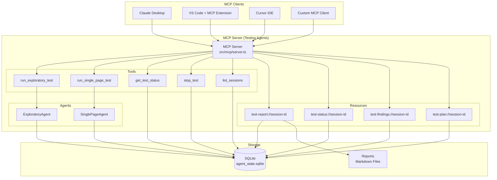

# RFC: Model Context Protocol (MCP) Integration for Testing Agents

**Status:** Draft  
**Author:** Crisler Wintler  
**Created:** 2026-01-08  
**Updated:** 2026-01-08

## Executive Summary

This RFC proposes implementing a **Model Context Protocol (MCP) server** to expose the testing agents (Exploratory and Single-Page) as controllable tools accessible from IDEs (VS Code, Cursor, etc.) and AI assistants (Claude Desktop, etc.). This will enable developers to trigger automated testing directly from their development environment and receive real-time feedback on bugs and issues.

## Motivation

### Current State

The testing agents currently operate as standalone CLI applications:
- Users must manually run `bun run cli` to start testing
- No integration with development workflows
- Results are only available after full test completion
- No way to trigger tests from AI assistants or IDEs

### Problem Statement

Modern development workflows require:
- **Seamless Integration**: Testing should be accessible from where developers work (IDE, AI assistants)
- **Real-time Feedback**: Developers need immediate bug reports during development
- **Contextual Testing**: Ability to test specific pages or features on-demand
- **AI-Assisted QA**: AI assistants should be able to run tests and interpret results
- **Programmatic Control**: Other tools should be able to trigger and monitor tests

### Proposed Solution

Implement an **MCP server** that:
1. Exposes testing agents as callable tools via the Model Context Protocol
2. Provides real-time test execution and progress updates
3. Enables IDE and AI assistant integration
4. Offers programmatic control over test configuration and execution
5. Streams test results and findings as they occur

## Background: Model Context Protocol (MCP)

### What is MCP?

The Model Context Protocol is an open standard introduced by Anthropic in November 2024 to standardize how AI systems integrate with external tools and data sources.

**Key Features:**
- **Client-Server Architecture**: AI applications (clients) connect to MCP servers
- **JSON-RPC 2.0**: Communication protocol for tool invocation
- **Universal Interface**: Standardized way to expose tools, resources, and prompts
- **Language Support**: SDKs available for TypeScript, Python, C#, Java

### MCP Concepts

1. **Tools**: Executable functions that AI can invoke (e.g., `run_exploratory_test`)
2. **Resources**: Data sources that AI can read (e.g., test reports, session state)
3. **Prompts**: Reusable prompt templates for common tasks
4. **Sampling**: Server-initiated LLM requests (optional)

### Why MCP for Testing Agents?

- ✅ **Standardized Integration**: Works with any MCP-compatible client (Claude, IDEs)
- ✅ **Real-time Communication**: JSON-RPC enables streaming updates
- ✅ **Tool Discovery**: Clients automatically discover available testing capabilities
- ✅ **Type Safety**: TypeScript SDK provides strong typing
- ✅ **Future-Proof**: Open standard with growing ecosystem

## Design

### Architecture Overview



### MCP Server Implementation

#### Server Structure

```typescript
// src/mcp/server.ts
import { Server } from "@modelcontextprotocol/sdk/server/index.js";
import { StdioServerTransport } from "@modelcontextprotocol/sdk/server/stdio.js";
import {
  CallToolRequestSchema,
  ListResourcesRequestSchema,
  ListToolsRequestSchema,
  ReadResourceRequestSchema,
} from "@modelcontextprotocol/sdk/types.js";

export class TestingAgentMCPServer {
  private server: Server;
  private activeTests: Map<string, TestExecution>;
  
  constructor() {
    this.server = new Server(
      {
        name: "testing-agent-server",
        version: "1.0.0",
      },
      {
        capabilities: {
          tools: {},
          resources: {},
        },
      }
    );
    
    this.setupHandlers();
  }
  
  private setupHandlers() {
    // Tool handlers
    this.server.setRequestHandler(ListToolsRequestSchema, this.handleListTools);
    this.server.setRequestHandler(CallToolRequestSchema, this.handleCallTool);
    
    // Resource handlers
    this.server.setRequestHandler(ListResourcesRequestSchema, this.handleListResources);
    this.server.setRequestHandler(ReadResourceRequestSchema, this.handleReadResource);
  }
  
  async start() {
    const transport = new StdioServerTransport();
    await this.server.connect(transport);
  }
}
```

### Exposed Tools

#### 1. `run_exploratory_test`

Starts an exploratory test session across multiple pages.

**Input Schema:**
```typescript
{
  name: "run_exploratory_test",
  description: "Start an exploratory testing session to discover and test multiple pages",
  inputSchema: {
    type: "object",
    properties: {
      baseUrl: {
        type: "string",
        description: "Base URL of the application to test"
      },
      maxSteps: {
        type: "number",
        description: "Maximum number of exploration steps (default: 50)"
      },
      mode: {
        type: "string",
        enum: ["autonomous", "guided"],
        description: "Testing mode"
      },
      sessionId: {
        type: "string",
        description: "Optional session ID to resume existing session"
      }
    },
    required: ["baseUrl"]
  }
}
```

**Output:**
```typescript
{
  sessionId: string;
  status: "started" | "running" | "completed";
  message: string;
  stats: {
    visitedPages: number;
    findingsCount: number;
    queueLength: number;
  };
}
```

#### 2. `run_single_page_test`

Executes comprehensive testing on a single page.

**Input Schema:**
```typescript
{
  name: "run_single_page_test",
  description: "Run comprehensive testing on a single page using plan-execute approach",
  inputSchema: {
    type: "object",
    properties: {
      targetUrl: {
        type: "string",
        description: "URL of the page to test"
      },
      strategy: {
        type: "string",
        enum: ["comprehensive", "critical-path", "edge-cases"],
        description: "Testing strategy to use"
      },
      maxTestCases: {
        type: "number",
        description: "Maximum number of test cases to execute"
      },
      sessionId: {
        type: "string",
        description: "Optional session ID to resume"
      }
    },
    required: ["targetUrl"]
  }
}
```

**Output:**
```typescript
{
  sessionId: string;
  status: "planning" | "executing" | "completed";
  testPlan: {
    totalTests: number;
    estimatedDuration: number;
  };
  progress: {
    completedTests: number;
    failedTests: number;
    passedTests: number;
  };
}
```

#### 3. `get_test_status`

Retrieves real-time status of a running test.

**Input Schema:**
```typescript
{
  name: "get_test_status",
  description: "Get real-time status of a running test session",
  inputSchema: {
    type: "object",
    properties: {
      sessionId: {
        type: "string",
        description: "Session ID of the test"
      }
    },
    required: ["sessionId"]
  }
}
```

**Output:**
```typescript
{
  sessionId: string;
  status: "running" | "completed" | "failed" | "stopped";
  progress: number; // 0-100
  currentAction: string;
  stats: {
    visitedPages?: number;
    findingsCount: number;
    executedTests?: number;
  };
  recentFindings: AgentFinding[];
}
```

#### 4. `stop_test`

Stops a running test session gracefully.

**Input Schema:**
```typescript
{
  name: "stop_test",
  description: "Stop a running test session and generate final report",
  inputSchema: {
    type: "object",
    properties: {
      sessionId: {
        type: "string",
        description: "Session ID of the test to stop"
      }
    },
    required: ["sessionId"]
  }
}
```

#### 5. `list_sessions`

Lists all test sessions (active and historical).

**Input Schema:**
```typescript
{
  name: "list_sessions",
  description: "List all test sessions with their status and metadata",
  inputSchema: {
    type: "object",
    properties: {
      status: {
        type: "string",
        enum: ["all", "active", "completed"],
        description: "Filter sessions by status"
      },
      limit: {
        type: "number",
        description: "Maximum number of sessions to return"
      }
    }
  }
}
```

### Exposed Resources

Resources provide read-only access to test data using URI schemes.

#### 1. `test-report://`

Access test reports in markdown format.

**URI Pattern:** `test-report://{sessionId}`

**Example:**
```
test-report://session-abc123
```

**Returns:** Full markdown test report with findings, screenshots, and statistics.

#### 2. `test-status://`

Real-time test execution status.

**URI Pattern:** `test-status://{sessionId}`

**Returns:** JSON object with current test status, progress, and recent activity.

#### 3. `test-findings://`

List of all findings from a test session.

**URI Pattern:** `test-findings://{sessionId}?severity={severity}&type={type}`

**Query Parameters:**
- `severity`: Filter by severity (low, medium, high, critical)
- `type`: Filter by type (broken_image, console_error, etc.)

**Returns:** JSON array of findings with details.

#### 4. `test-plan://`

Test plan for single-page testing sessions.

**URI Pattern:** `test-plan://{sessionId}`

**Returns:** JSON object with complete test plan including test cases and coverage.

### Exposed Prompts

Reusable prompt templates for common testing scenarios.

#### 1. `test-login-page`

```typescript
{
  name: "test-login-page",
  description: "Comprehensive testing prompt for login pages",
  arguments: [
    {
      name: "loginUrl",
      description: "URL of the login page",
      required: true
    }
  ]
}
```

#### 2. `test-checkout-flow`

```typescript
{
  name: "test-checkout-flow",
  description: "E-commerce checkout flow testing prompt",
  arguments: [
    {
      name: "checkoutUrl",
      description: "URL of the checkout page",
      required: true
    }
  ]
}
```

## Implementation Plan

### Phase 1: MCP Server Foundation

#### Tasks
- [ ] Install MCP SDK dependencies
  ```bash
  bun add @modelcontextprotocol/sdk
  ```
- [ ] Create MCP server structure in `src/mcp/`
  - `src/mcp/server.ts` - Main server implementation
  - `src/mcp/tools/` - Tool handlers
  - `src/mcp/resources/` - Resource handlers
  - `src/mcp/types.ts` - MCP-specific types
- [ ] Implement basic server with stdio transport
- [ ] Add tool discovery (ListTools handler)
- [ ] Add resource discovery (ListResources handler)

#### Files to Create
```
src/mcp/
├── server.ts                 # Main MCP server
├── types.ts                  # MCP-specific types
├── tools/
│   ├── exploratory.ts       # run_exploratory_test
│   ├── single-page.ts       # run_single_page_test
│   ├── status.ts            # get_test_status, stop_test
│   └── sessions.ts          # list_sessions
└── resources/
    ├── reports.ts           # test-report:// handler
    ├── status.ts            # test-status:// handler
    ├── findings.ts          # test-findings:// handler
    └── plans.ts             # test-plan:// handler
```

### Phase 2: Tool Implementation

#### Tasks
- [ ] Implement `run_exploratory_test` tool
  - Integrate with existing `ExploratoryAgent`
  - Add session management
  - Implement progress callbacks
- [ ] Implement `run_single_page_test` tool
  - Integrate with `SinglePageTestingAgent` (from previous RFC)
  - Add plan streaming
  - Implement test result callbacks
- [ ] Implement `get_test_status` tool
  - Query session repository
  - Format real-time status
- [ ] Implement `stop_test` tool
  - Graceful shutdown mechanism
  - Final report generation
- [ ] Implement `list_sessions` tool
  - Query all sessions from SQLite
  - Add filtering and pagination

### Phase 3: Resource Implementation

#### Tasks
- [ ] Implement `test-report://` resource
  - Read markdown reports from filesystem
  - Support URI parameters
- [ ] Implement `test-status://` resource
  - Real-time status from session repository
  - Include progress metrics
- [ ] Implement `test-findings://` resource
  - Query findings from session state
  - Add filtering by severity/type
- [ ] Implement `test-plan://` resource
  - Retrieve test plans for single-page tests
  - Format as structured JSON

### Phase 4: Client Integration & Testing

#### Tasks
- [ ] Create MCP configuration for Claude Desktop
  - Add to `claude_desktop_config.json`
  - Document setup process
- [ ] Create VS Code MCP extension configuration
  - Document installation steps
  - Provide example usage
- [ ] Write integration tests
  - Test tool invocation
  - Test resource reading
  - Test error handling
- [ ] Create usage documentation
  - Quick start guide
  - Example workflows
  - Troubleshooting guide
- [ ] Add CLI command to start MCP server
  ```bash
  bun run mcp-server
  ```

## Technical Details

### MCP Server Entry Point

```typescript
// src/mcp/index.ts
import { TestingAgentMCPServer } from "./server.js";

async function main() {
  const server = new TestingAgentMCPServer();
  await server.start();
  
  // Keep process alive
  process.on("SIGINT", async () => {
    await server.stop();
    process.exit(0);
  });
}

main().catch(console.error);
```

### Package.json Updates

```json
{
  "scripts": {
    "cli": "bun run src/index.ts",
    "mcp-server": "bun run src/mcp/index.ts"
  },
  "dependencies": {
    "@modelcontextprotocol/sdk": "^1.0.0"
  }
}
```

### Claude Desktop Configuration

Users will add this to their `claude_desktop_config.json`:

```json
{
  "mcpServers": {
    "testing-agent": {
      "command": "bun",
      "args": ["run", "mcp-server"],
      "cwd": "/path/to/voidr-tech-challenge",
      "env": {
        "GOOGLE_AI_STUDIO_API_KEY": "your-key-here"
      }
    }
  }
}
```

### Tool Handler Example

```typescript
// src/mcp/tools/exploratory.ts
import { ExploratoryAgent } from "../../agents/exploratory.js";
import type { CallToolRequest } from "@modelcontextprotocol/sdk/types.js";

export async function handleRunExploratoryTest(
  request: CallToolRequest
): Promise<any> {
  const { baseUrl, maxSteps, mode, sessionId } = request.params.arguments;
  
  // Validate inputs
  if (!baseUrl || typeof baseUrl !== "string") {
    throw new Error("baseUrl is required and must be a string");
  }
  
  // Generate session ID if not provided
  const testSessionId = sessionId || `exp-${Date.now()}`;
  
  // Create agent instance
  const agent = new ExploratoryAgent({
    baseUrl,
    maxSteps: maxSteps || 50,
    sessionId: testSessionId,
  });
  
  // Start test in background
  startTestInBackground(agent, testSessionId);
  
  return {
    content: [
      {
        type: "text",
        text: JSON.stringify({
          sessionId: testSessionId,
          status: "started",
          message: `Exploratory test started for ${baseUrl}`,
          stats: {
            visitedPages: 0,
            findingsCount: 0,
            queueLength: 0,
          },
        }, null, 2),
      },
    ],
  };
}

async function startTestInBackground(
  agent: ExploratoryAgent,
  sessionId: string
) {
  try {
    await agent.start();
    
    // Run until completion or max steps
    let completed = false;
    while (!completed) {
      const result = await agent.step();
      completed = result.completed;
      
      // Update session state in database
      // (handled by agent internally)
    }
    
    await agent.stop();
  } catch (error) {
    console.error(`Test ${sessionId} failed:`, error);
    // Update session status to failed
  }
}
```

### Resource Handler Example

```typescript
// src/mcp/resources/reports.ts
import { readFile } from "fs/promises";
import { join } from "path";
import type { ReadResourceRequest } from "@modelcontextprotocol/sdk/types.js";

export async function handleTestReportResource(
  request: ReadResourceRequest
): Promise<any> {
  const uri = request.params.uri; // e.g., "test-report://session-abc123"
  const sessionId = uri.replace("test-report://", "");
  
  // Read report file
  const reportPath = join(process.cwd(), "reports", `report-${sessionId}.md`);
  
  try {
    const reportContent = await readFile(reportPath, "utf-8");
    
    return {
      contents: [
        {
          uri,
          mimeType: "text/markdown",
          text: reportContent,
        },
      ],
    };
  } catch (error) {
    throw new Error(`Report not found for session ${sessionId}`);
  }
}
```

## Integration Examples

### Example 1: Claude Desktop Usage

**User:** "Test the login page at https://example.com/login"

**Claude:** *Uses MCP to call `run_single_page_test`*
```
Tool: run_single_page_test
Arguments:
{
  "targetUrl": "https://example.com/login",
  "strategy": "comprehensive"
}
```

**Result:**
```json
{
  "sessionId": "sp-1736341200",
  "status": "planning",
  "testPlan": {
    "totalTests": 15,
    "estimatedDuration": 120
  }
}
```

**Claude:** "I've started a comprehensive test of the login page. The test plan includes 15 test cases and should take about 2 minutes. Let me check the status..."

*Uses MCP to call `get_test_status`*

**Claude:** "The test is complete! I found 3 issues:
1. **High Severity**: Login button doesn't validate empty email field
2. **Medium Severity**: Password field accepts passwords under 8 characters
3. **Low Severity**: Error messages lack specific guidance

Would you like me to read the full report?"

### Example 2: VS Code Integration

Developer opens command palette:
```
> MCP: Run Exploratory Test
```

Enters base URL: `https://staging.myapp.com`

Extension calls MCP tool and shows progress in sidebar:
```
🔍 Exploratory Test Running
━━━━━━━━━━━━━━━━━━━━ 45%

📊 Progress:
  • Visited: 12 pages
  • Queue: 15 pages
  • Findings: 7 bugs

🐛 Recent Findings:
  • Broken image on /products
  • 404 error on /api/users
  • Console error on /checkout
```

### Example 3: Programmatic Usage

```typescript
import { Client } from "@modelcontextprotocol/sdk/client/index.js";
import { StdioClientTransport } from "@modelcontextprotocol/sdk/client/stdio.js";

// Connect to MCP server
const transport = new StdioClientTransport({
  command: "bun",
  args: ["run", "mcp-server"],
});

const client = new Client({
  name: "test-runner",
  version: "1.0.0",
}, {
  capabilities: {},
});

await client.connect(transport);

// Run test
const result = await client.callTool({
  name: "run_exploratory_test",
  arguments: {
    baseUrl: "https://example.com",
    maxSteps: 30,
  },
});

console.log("Test started:", result);

// Poll for status
const sessionId = JSON.parse(result.content[0].text).sessionId;

setInterval(async () => {
  const status = await client.callTool({
    name: "get_test_status",
    arguments: { sessionId },
  });
  
  console.log("Status:", status);
}, 5000);
```

## Benefits

### For Developers
- ✅ **Seamless Testing**: Run tests directly from IDE or AI assistant
- ✅ **Immediate Feedback**: Get bug reports while coding
- ✅ **Context-Aware**: AI assistants can interpret results and suggest fixes
- ✅ **No Context Switching**: Stay in development environment

### For QA Teams
- ✅ **Programmatic Control**: Integrate with CI/CD pipelines
- ✅ **Automated Reporting**: Real-time access to test results
- ✅ **Flexible Testing**: Choose exploratory or focused testing strategies

### For Organizations
- ✅ **Standardized Integration**: MCP is an open standard
- ✅ **Future-Proof**: Growing ecosystem of MCP-compatible tools
- ✅ **Scalable**: Can be deployed as a service
- ✅ **Interoperable**: Works with multiple AI assistants and IDEs

## Trade-offs and Considerations

### Advantages
- **Universal Access**: Works with any MCP client
- **Real-time Updates**: JSON-RPC enables streaming
- **Type Safety**: Strong typing with TypeScript SDK
- **Discoverability**: Tools and resources auto-discovered
- **Standardized**: Open protocol with broad adoption

### Disadvantages
- **Additional Complexity**: New layer to maintain
- **MCP Learning Curve**: Developers need to understand MCP
- **Client Dependency**: Requires MCP-compatible clients
- **Performance Overhead**: JSON-RPC serialization costs

### Mitigation Strategies
- **Maintain CLI**: Keep existing CLI for standalone use
- **Documentation**: Comprehensive setup guides
- **Examples**: Provide ready-to-use configurations
- **Monitoring**: Add logging and error tracking

## Security Considerations

### Authentication
- MCP server runs locally (stdio transport)
- No network exposure by default
- Environment variables for API keys

### Authorization
- Session isolation per client
- Read-only resources
- Tool execution requires explicit invocation

### Data Privacy
- Test data stored locally in SQLite
- Reports contain only public URLs
- No sensitive data transmitted

## Success Metrics

- **Adoption**: Number of developers using MCP integration
- **Usage**: Number of tests triggered via MCP per week
- **Performance**: Average response time for tool calls
- **Reliability**: Success rate of MCP tool invocations
- **Satisfaction**: Developer feedback on integration

## Open Questions

1. **Streaming Updates**: Should we implement progress streaming during long tests?
   - Proposed: Use MCP notifications for progress updates
2. **Multi-Client**: How to handle multiple clients testing simultaneously?
   - Proposed: Session-based isolation
3. **Resource Caching**: Should resources be cached or always fresh?
   - Proposed: Fresh reads for status, cached for reports
4. **Error Recovery**: How to handle agent crashes during MCP execution?
   - Proposed: Graceful degradation with error resources

## Alternatives Considered

### 1. REST API
**Pros**: Well-understood, language-agnostic  
**Cons**: Requires server deployment, no AI assistant integration

### 2. gRPC
**Pros**: High performance, streaming support  
**Cons**: Complex setup, no AI assistant support

### 3. WebSocket API
**Pros**: Real-time bidirectional communication  
**Cons**: Requires server, no standardized AI integration

**Decision**: MCP provides the best balance of AI integration, standardization, and ease of use.

## References

- [Model Context Protocol Specification](https://modelcontextprotocol.io/)
- [MCP TypeScript SDK](https://github.com/modelcontextprotocol/typescript-sdk)
- [Claude Desktop MCP Integration](https://docs.anthropic.com/claude/docs/model-context-protocol)
- [Existing ExploratoryAgent](file:///home/crislerwintler/Projects/voidr-tech-challenge/src/agents/exploratory.ts)
- [Single-Page Testing Agent RFC](file:///home/crislerwintler/Projects/voidr-tech-challenge/docs/rfc-single-page-testing-agent.md)

## Appendix A: Complete Tool Definitions

```typescript
// src/mcp/tools/definitions.ts
export const TOOL_DEFINITIONS = [
  {
    name: "run_exploratory_test",
    description: "Start an exploratory testing session to discover and test multiple pages",
    inputSchema: {
      type: "object",
      properties: {
        baseUrl: {
          type: "string",
          description: "Base URL of the application to test",
        },
        maxSteps: {
          type: "number",
          description: "Maximum number of exploration steps (default: 50)",
          default: 50,
        },
        mode: {
          type: "string",
          enum: ["autonomous", "guided"],
          description: "Testing mode: autonomous or guided",
          default: "autonomous",
        },
        sessionId: {
          type: "string",
          description: "Optional session ID to resume existing session",
        },
      },
      required: ["baseUrl"],
    },
  },
  {
    name: "run_single_page_test",
    description: "Run comprehensive testing on a single page using plan-execute approach",
    inputSchema: {
      type: "object",
      properties: {
        targetUrl: {
          type: "string",
          description: "URL of the page to test",
        },
        strategy: {
          type: "string",
          enum: ["comprehensive", "critical-path", "edge-cases"],
          description: "Testing strategy to use",
          default: "comprehensive",
        },
        maxTestCases: {
          type: "number",
          description: "Maximum number of test cases to execute",
        },
        sessionId: {
          type: "string",
          description: "Optional session ID to resume",
        },
      },
      required: ["targetUrl"],
    },
  },
  {
    name: "get_test_status",
    description: "Get real-time status of a running test session",
    inputSchema: {
      type: "object",
      properties: {
        sessionId: {
          type: "string",
          description: "Session ID of the test",
        },
      },
      required: ["sessionId"],
    },
  },
  {
    name: "stop_test",
    description: "Stop a running test session and generate final report",
    inputSchema: {
      type: "object",
      properties: {
        sessionId: {
          type: "string",
          description: "Session ID of the test to stop",
        },
      },
      required: ["sessionId"],
    },
  },
  {
    name: "list_sessions",
    description: "List all test sessions with their status and metadata",
    inputSchema: {
      type: "object",
      properties: {
        status: {
          type: "string",
          enum: ["all", "active", "completed"],
          description: "Filter sessions by status",
          default: "all",
        },
        limit: {
          type: "number",
          description: "Maximum number of sessions to return",
          default: 10,
        },
      },
    },
  },
];
```

## Appendix B: MCP Server Configuration Examples

### Claude Desktop (macOS)

Location: `~/Library/Application Support/Claude/claude_desktop_config.json`

```json
{
  "mcpServers": {
    "testing-agent": {
      "command": "bun",
      "args": ["run", "mcp-server"],
      "cwd": "/Users/username/Projects/voidr-tech-challenge",
      "env": {
        "GOOGLE_AI_STUDIO_API_KEY": "your-api-key-here",
        "GEMINI_MODEL": "gemini-2.0-flash-exp"
      }
    }
  }
}
```

### Claude Desktop (Windows)

Location: `%APPDATA%\Claude\claude_desktop_config.json`

```json
{
  "mcpServers": {
    "testing-agent": {
      "command": "bun.exe",
      "args": ["run", "mcp-server"],
      "cwd": "C:\\Users\\username\\Projects\\voidr-tech-challenge",
      "env": {
        "GOOGLE_AI_STUDIO_API_KEY": "your-api-key-here"
      }
    }
  }
}
```

### VS Code MCP Extension

Location: `.vscode/mcp.json`

```json
{
  "servers": {
    "testing-agent": {
      "command": "bun",
      "args": ["run", "mcp-server"],
      "env": {
        "GOOGLE_AI_STUDIO_API_KEY": "${env:GOOGLE_AI_STUDIO_API_KEY}"
      }
    }
  }
}
```
