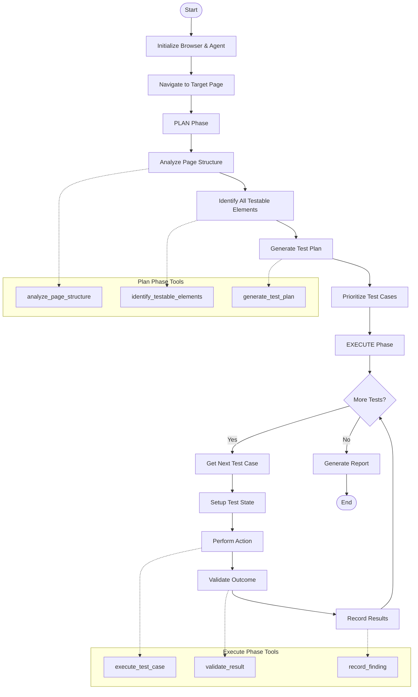

# RFC: Single-Page Testing Agent with Plan-Execute Architecture

**Status:** Draft  
**Author:** Crisler Wintler  
**Created:** 2026-01-08  
**Updated:** 2026-01-08

## Executive Summary

This RFC proposes the implementation of a **Single-Page Testing Agent** that uses a **Plan-Execute** architectural pattern to comprehensively test all features and interactions on a single web page. Unlike the existing exploratory agent that navigates across multiple pages, this agent will focus on deep, systematic testing of a single page's functionality.

## Motivation

### Current State

The existing `ExploratoryAgent` follows an "Observe-Think-Act" loop optimized for breadth-first exploration across multiple pages. While effective for discovering pages and surface-level bugs, it has limitations:

- **Shallow Testing**: Moves to new pages quickly without exhaustively testing current page features
- **Limited Feature Coverage**: May miss complex interaction patterns (e.g., multi-step forms, conditional UI states)
- **No Systematic Planning**: Reactive decision-making rather than proactive test planning
- **Incomplete State Coverage**: Doesn't systematically explore all possible UI states on a page

### Problem Statement

Many bugs exist in complex page interactions that require:
- Testing all form fields with various input combinations
- Exploring all button/link interactions and their outcomes
- Validating all conditional UI states (modals, dropdowns, tooltips)
- Testing edge cases and boundary conditions
- Verifying multi-step workflows within a single page

### Proposed Solution

Implement a **Plan-Execute Agent** that:
1. **Plans**: Analyzes a page and creates a comprehensive test plan
2. **Executes**: Systematically executes each test case
3. **Validates**: Verifies expected outcomes and records findings
4. **Adapts**: Updates the plan based on discovered elements or states

## Design

### Architecture Overview



### Core Components

#### 1. SinglePageTestingAgent

```typescript
export class SinglePageTestingAgent {
  private browser: Browser | null = null;
  private page: Page | null = null;
  private model: BaseChatModel;
  private state: SinglePageTestState;
  private config: SinglePageTestConfig;
  
  // Main workflow
  async start(): Promise<void>;
  async planPhase(): Promise<TestPlan>;
  async executePhase(plan: TestPlan): Promise<TestResults>;
  async stop(): Promise<void>;
}
```

#### 2. New Types

```typescript
export interface SinglePageTestConfig {
  targetUrl: string;
  maxTestCases?: number;
  model?: BaseChatModel;
  sessionId?: string;
  testStrategy?: 'comprehensive' | 'critical-path' | 'edge-cases';
}

export interface TestCase {
  id: string;
  name: string;
  description: string;
  priority: 'critical' | 'high' | 'medium' | 'low';
  category: 'form' | 'navigation' | 'interaction' | 'validation' | 'visual';
  steps: TestStep[];
  expectedOutcome: string;
  preconditions?: string[];
}

export interface TestStep {
  action: 'click' | 'fill' | 'select' | 'hover' | 'wait' | 'verify';
  selector: string;
  value?: string;
  description: string;
}

export interface TestPlan {
  pageUrl: string;
  pageTitle: string;
  totalTests: number;
  testCases: TestCase[];
  coverage: {
    forms: number;
    buttons: number;
    links: number;
    inputs: number;
    otherInteractive: number;
  };
  estimatedDuration: number; // in seconds
}

export interface TestResult {
  testCaseId: string;
  status: 'passed' | 'failed' | 'skipped' | 'error';
  executionTime: number;
  findings: AgentFinding[];
  screenshot?: string;
  actualOutcome?: string;
  errorMessage?: string;
}

export interface SinglePageTestState {
  testPlan: TestPlan | null;
  executedTests: TestResult[];
  currentTestIndex: number;
  pageSnapshot: PageSnapshot;
  discoveredElements: DiscoveredElement[];
}

export interface PageSnapshot {
  url: string;
  title: string;
  forms: FormElement[];
  buttons: ButtonElement[];
  links: LinkElement[];
  inputs: InputElement[];
  otherInteractive: InteractiveElement[];
}

export interface DiscoveredElement {
  type: string;
  selector: string;
  text: string;
  attributes: Record<string, string>;
  isVisible: boolean;
  boundingBox: { x: number; y: number; width: number; height: number };
}
```

### Plan Phase

The planning phase uses the LLM to analyze the page and generate a comprehensive test plan:

1. **Page Analysis**
   - Extract all interactive elements (forms, buttons, inputs, links, etc.)
   - Identify element relationships (form fields → submit button)
   - Detect dynamic elements (modals, dropdowns, tooltips)
   - Map out page states (logged in/out, cart empty/full, etc.)

2. **Test Case Generation**
   - **Form Testing**: All fields with valid/invalid/boundary inputs
   - **Button Testing**: All clickable elements and their outcomes
   - **Navigation Testing**: All links and their destinations
   - **Validation Testing**: Error messages, required fields, format validation
   - **Edge Cases**: Empty inputs, special characters, max length, etc.
   - **Interaction Patterns**: Multi-step workflows, conditional UI

3. **Prioritization**
   - Critical: Login, checkout, data submission
   - High: Primary user flows, important features
   - Medium: Secondary features, nice-to-have functionality
   - Low: Cosmetic elements, non-essential interactions

### Execute Phase

The execution phase systematically runs each test case:

1. **Test Execution Loop**
   ```
   For each test case in plan:
     1. Setup: Navigate to page, set preconditions
     2. Execute: Perform test steps sequentially
     3. Validate: Check expected outcome vs actual
     4. Record: Save results and findings
     5. Cleanup: Reset page state if needed
   ```

2. **Automatic Validation**
   - Console errors during test execution
   - Network failures during interactions
   - Validation errors appearing on page
   - Visual regressions (broken images, layout issues)
   - Unexpected navigation or state changes

3. **Adaptive Planning**
   - If new elements are discovered during execution, add them to plan
   - If a test reveals a new page state, generate tests for that state
   - If a critical bug is found, prioritize related tests

### New Tools

#### Planning Tools

```typescript
// Analyzes page structure and extracts all testable elements
async function analyzePageStructure(page: Page): Promise<PageSnapshot>;

// Generates comprehensive test plan using LLM
async function generateTestPlan(
  snapshot: PageSnapshot,
  strategy: TestStrategy
): Promise<TestPlan>;

// Prioritizes test cases based on risk and importance
async function prioritizeTestCases(
  testCases: TestCase[]
): Promise<TestCase[]>;
```

#### Execution Tools

```typescript
// Executes a single test case
async function executeTestCase(
  page: Page,
  testCase: TestCase
): Promise<TestResult>;

// Validates test outcome against expectations
async function validateTestOutcome(
  page: Page,
  expected: string,
  actual: string
): Promise<boolean>;

// Resets page state between tests
async function resetPageState(page: Page, baseUrl: string): Promise<void>;
```

## Implementation Plan

### Phase 1: Core Infrastructure   
- [ ] Create `SinglePageTestingAgent` class
- [ ] Define new TypeScript interfaces
- [ ] Implement basic plan-execute loop
- [ ] Add page analysis tool

### Phase 2: Planning Phase 
- [ ] Implement `analyzePageStructure` tool
- [ ] Create LLM prompt for test plan generation
- [ ] Implement test case prioritization logic
- [ ] Add test plan persistence

### Phase 3: Execution Phase
- [ ] Implement test case execution engine
- [ ] Add automatic validation tools
- [ ] Implement state reset mechanism
- [ ] Add screenshot capture for each test

### Phase 4: Reporting & Integration
- [ ] Create detailed test report generator
- [ ] Add CLI integration for single-page mode
- [ ] Implement session persistence
- [ ] Add test plan export/import

## Trade-offs and Considerations

### Advantages
- **Comprehensive Coverage**: Tests all features on a page systematically
- **Better Bug Detection**: Finds complex interaction bugs
- **Reproducible**: Test plans can be saved and re-executed
- **Focused**: Deep testing rather than shallow exploration
- **Adaptable**: Can adjust plan based on discoveries

### Disadvantages
- **Time-Intensive**: Deep testing takes longer than exploration
- **Single-Page Limitation**: Doesn't test cross-page workflows
- **LLM Cost**: More LLM calls for planning and validation
- **Complexity**: More complex state management

### Mitigation Strategies
- **Configurable Depth**: Allow users to choose test strategy (quick/comprehensive)
- **Parallel Execution**: Run independent tests in parallel
- **Smart Caching**: Cache page analysis to reduce redundant work
- **Hybrid Mode**: Combine with exploratory agent for full coverage

## Success Metrics

- **Coverage**: % of interactive elements tested
- **Bug Detection**: Number of unique bugs found per page
- **Efficiency**: Time to complete comprehensive page test
- **Reproducibility**: Ability to re-run same test plan
- **Adaptability**: % of dynamically discovered elements tested

## Open Questions

1. **State Management**: How to handle complex page states (e.g., logged in vs out)?
2. **Test Data**: Should we generate test data or require user input?
3. **Parallel Execution**: Can we safely run tests in parallel?
4. **Integration**: How does this integrate with the existing exploratory agent?
5. **Reporting**: What level of detail should reports include?

## Alternatives Considered

### 1. Extend Exploratory Agent
**Pros**: Reuse existing code, simpler architecture  
**Cons**: Conflicting goals (breadth vs depth), harder to maintain

### 2. Scripted Testing
**Pros**: Deterministic, fast execution  
**Cons**: No LLM intelligence, can't adapt to changes

### 3. Hybrid Approach
**Pros**: Best of both worlds  
**Cons**: More complex, harder to reason about

**Decision**: Implement as separate agent with potential for hybrid mode later.

## References

- [Existing ExploratoryAgent Implementation](file:///home/crislerwintler/Projects/voidr-tech-challenge/src/agents/exploratory.ts)
- [Agent Types](file:///home/crislerwintler/Projects/voidr-tech-challenge/src/types/index.ts)
- [ReAct: Synergizing Reasoning and Acting in Language Models](https://arxiv.org/abs/2210.03629)
- [Plan-and-Execute Agents (LangChain)](https://python.langchain.com/docs/modules/agents/agent_types/plan_and_execute)

## Appendix A: Example Test Plan

```json
{
  "pageUrl": "https://example.com/login",
  "pageTitle": "Login Page",
  "totalTests": 12,
  "testCases": [
    {
      "id": "TC001",
      "name": "Valid Login",
      "description": "Test login with valid credentials",
      "priority": "critical",
      "category": "form",
      "steps": [
        {
          "action": "fill",
          "selector": "#email",
          "value": "test@example.com",
          "description": "Enter valid email"
        },
        {
          "action": "fill",
          "selector": "#password",
          "value": "ValidPass123!",
          "description": "Enter valid password"
        },
        {
          "action": "click",
          "selector": "button[type='submit']",
          "description": "Click login button"
        }
      ],
      "expectedOutcome": "User is redirected to dashboard"
    },
    {
      "id": "TC002",
      "name": "Invalid Email Format",
      "description": "Test login with invalid email format",
      "priority": "high",
      "category": "validation",
      "steps": [
        {
          "action": "fill",
          "selector": "#email",
          "value": "notanemail",
          "description": "Enter invalid email"
        },
        {
          "action": "click",
          "selector": "button[type='submit']",
          "description": "Click login button"
        }
      ],
      "expectedOutcome": "Validation error shown for email field"
    }
  ],
  "coverage": {
    "forms": 1,
    "buttons": 2,
    "links": 3,
    "inputs": 2,
    "otherInteractive": 0
  },
  "estimatedDuration": 180
}
```

## Appendix B: LLM Prompts

### Planning Prompt Template

```
You are a QA Test Planning Agent. Your goal is to create a comprehensive test plan for a single web page.

Page URL: {url}
Page Title: {title}
Test Strategy: {strategy}

Page Elements:
{elements_json}

Create a comprehensive test plan that includes:
1. Form validation tests (valid, invalid, boundary cases)
2. Button/link interaction tests
3. Edge case tests (empty inputs, special characters, etc.)
4. Visual validation tests
5. Error handling tests

For each test case, provide:
- Unique ID
- Name and description
- Priority (critical/high/medium/low)
- Category (form/navigation/interaction/validation/visual)
- Step-by-step actions
- Expected outcome

Return a JSON object matching the TestPlan interface.
```

### Execution Prompt Template

```
You are executing test case: {test_case_name}

Current Page State:
{page_state}

Test Steps:
{test_steps}

Expected Outcome:
{expected_outcome}

Actual Outcome:
{actual_outcome}

Determine if the test PASSED or FAILED. If failed, identify the bug type and severity.
Return a JSON object with: status, findings (if any), and analysis.
```
