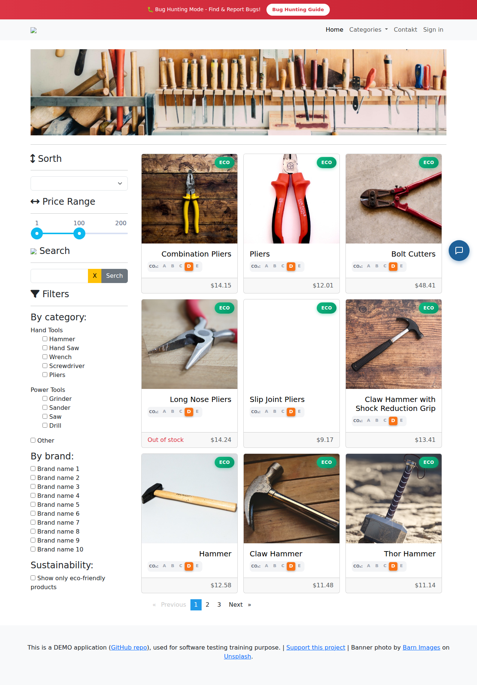

# Exploratory Testing Report
Date: 1/30/2026, 5:01:04 PM
Target: with-bugs.practicesoftwaretesting.com

## Summary
Total Findings: 2
Pages Explored: 1

## Navigated Pages
- https://with-bugs.practicesoftwaretesting.com/#/

## Findings

### 1. [BROKEN_IMAGE] [MEDIUM]
**URL**: https://with-bugs.practicesoftwaretesting.com/#/
**Description**: Broken image: broken.png (Reason: Image loaded with 0x0 dimensions (failed to decode or 404))
**Selector**: `a.navbar-brand > img`
**Screenshot**:

---
### 2. [BROKEN_IMAGE] [MEDIUM]
**URL**: https://with-bugs.practicesoftwaretesting.com/#/
**Description**: Broken image: broken.png (Reason: Image loaded with 0x0 dimensions (failed to decode or 404))
**Selector**: `h4.grid-title > img`
**Screenshot**:

---
